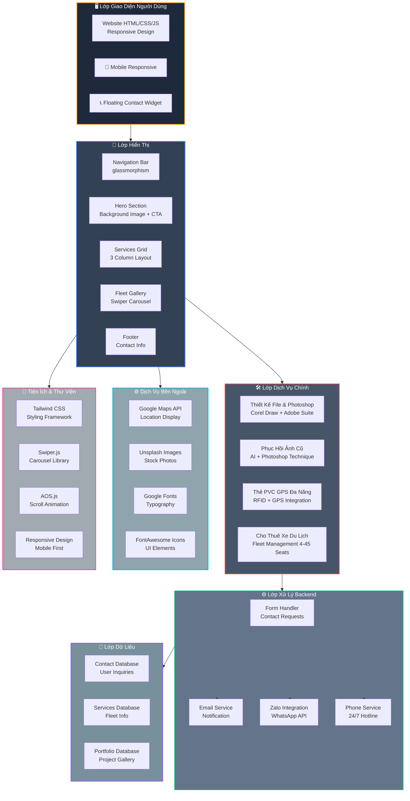
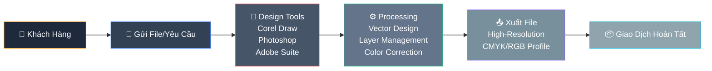
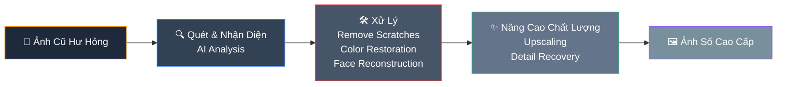
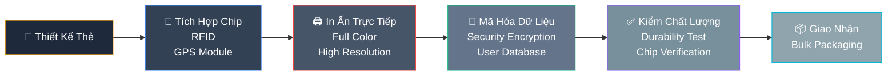
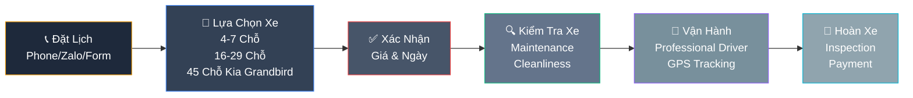
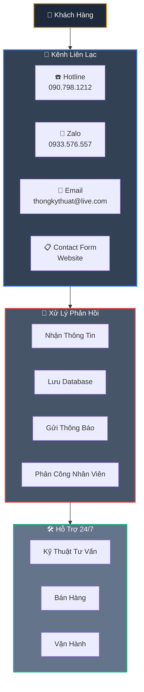

# thong-design-website
# THONG DESIGN - Kiến Trúc Hệ Thống

## 📋 Tổng Quan Kiến Trúc

Kiến trúc của THONG DESIGN được thiết kế để hỗ trợ 4 dòng dịch vụ chính với hiệu suất cao và trải nghiệm người dùng tối ưu.



---

## 📊 Kiến Trúc Chi Tiết các Dịch Vụ

### 1. Dịch Vụ Thiết Kế File & Photoshop



---

### 2. Dịch Vụ Phục Hồi Ảnh Cũ



---

### 3. Dịch Vụ Thẻ PVC GPS Đa Năng



---

### 4. Dịch Vụ Cho Thuê Xe Du Lịch



---

## 🔌 Tích Hợp Hệ Thống Liên Lạc



---

## 🎯 Công nghệ & Stack

| Thành Phần | Công Nghệ |
|-----------|----------|
| **Frontend Framework** | HTML5, CSS3, Tailwind CSS |
| **JavaScript Libraries** | Swiper.js (Carousel), AOS.js (Animations) |
| **Icons & Fonts** | FontAwesome 6.4.0, Google Fonts |
| **Design Tools** | Adobe Photoshop, Corel Draw |
| **AI Technology** | Image Restoration AI |
| **Hardware Integration** | RFID Chips, GPS Modules |
| **APIs** | Google Maps, Zalo, WhatsApp |
| **Responsive Design** | Mobile First, Breakpoints (md, lg) |
| **Performance** | Image Optimization, Lazy Loading |
| **SEO** | Meta Tags, Schema Markup |

---

## 📱 Responsive Design Breakpoints

```
Mobile:     < 640px  (Default)
Tablet:     640px - 1024px (md breakpoint)
Desktop:    > 1024px (lg breakpoint)
```

---

## 🎨 Color Scheme & Branding

```
Primary Dark:     #0b0f19 (brand-dark)
Secondary Dark:   #1e293b (brand-slate)
Accent Gold:      #f59e0b (brand-gold)
Gold Hover:       #d97706 (brand-goldHover)
Accent Blue:      #3b82f6 (brand-accent)
Red CTA:          #ef4444
Blue Secondary:   #0068ff
```

---

## 🚀 Deployment & Hosting


---

## 📞 Contact & Support

- **Hotline 24/7:** 090.798.1212
- **Zalo/WhatsApp:** 0933.576.557
- **Email:** thongkythuat@live.com
- **Service Area:** TP. Hồ Chí Minh

---

*Tài liệu này được cập nhật lần cuối: 2026*
